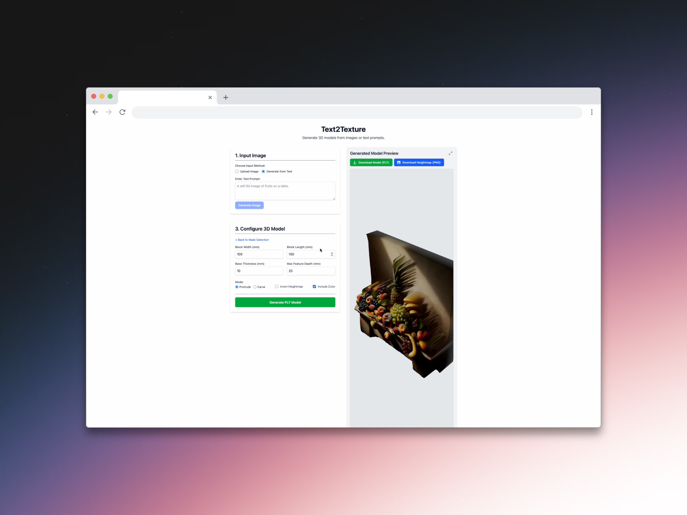

# Text2Texture

Text2Texture is a tool that allows you to generate 3D textures and models from text prompts or images.

📄 [**UIST 2025 Submission**](https://www.joshyin.cc/static/documents/text2texture-generating-3d-printed-models-with-textures.pdf)



## Features

- **Text-to-Image Generation**: Generate images from text prompts using OpenAI's DALL-E 3 or upload existing images
- **Depth Extraction**: Extract depth information from 2D images using ZoeDepth monocular estimator
- **Texture Synthesis**: Extract local texture heightmaps using a fine-tuned stable diffusion model
- **Composite 3D Model Generation**: Superimpose macro- and micro-scale geometries to produce textured 3D models with color, depth and texture ready for 3D printing
- **Automatic Segmentation**: Identify and segment objects in images using Florence-2 and SAM-HQ
- **Interactive Demo**: User-friendly web interface for creating, manipulating, and exporting 3D assets

## Repository Structure

```
text2texture/
├── checkpoints/             # Model checkpoints (created by download script)
├── configs/                 # Configuration files
├── demo/                    # Interactive web-based demo
│   ├── backend/             # Flask backend with AI models
│   │   ├── app.py           # Main Flask application
│   │   ├── requirements.txt # Python dependencies
│   │   └── ...
│   ├── frontend/            # React frontend interface
│   │   ├── src/             # React source code
│   │   └── ...
│   └── docker-compose.yml   # Docker setup for the demo
└── scripts/                 # Utility scripts
    └── download_checkpoints.sh  # Script to download model weights
```

## Getting Started

### Prerequisites

- Python 3.10+
- Node.js (for frontend development)
- Docker & Docker Compose (optional, for containerized deployment)
- GPU recommended for faster inference
- OpenAI API key for DALL-E image generation

### Setup

1. Clone the repository:

   ```bash
   git clone https://github.com/Subjective/text2texture.git
   cd text2texture
   ```

2. Download the required model checkpoints:

   ```bash
   bash scripts/download_checkpoints.sh
   ```

3. Set up the demo:

   #### Option 1: Using Docker (recommended for deployment)

   ```bash
   cd demo
   # Create a .env file in demo/backend with your OpenAI API key
   echo "OPENAI_API_KEY=your_openai_api_key" > backend/.env
   # Add other configuration as needed

   # Start the containers
   docker-compose up -d
   ```

   #### Option 2: Manual Setup (recommended for development)

   **Backend**:

   ```bash
   cd demo/backend
   # Create and activate a virtual environment
   python -m venv .venv
   source .venv/bin/activate  # On Windows: .venv\Scripts\activate
   pip install -r requirements.txt
   # Create .env file with your OpenAI API key and configuration
   echo "OPENAI_API_KEY=your_openai_api_key" > .env
   echo "SAM_HQ_CHECKPOINT_PATH=../../checkpoints/sam_hq_vit_h.pth" >> .env
   # Start the backend
   python app.py
   ```

   **Frontend**:

   ```bash
   cd demo/frontend
   npm install
   npm run dev
   ```

4. Access the demo:
   - Using Docker: http://localhost:8080
   - Manual setup: http://localhost:5173 (or the URL shown in terminal)

## Usage

1. Enter a descriptive text prompt to generate an image
2. Use automatic segmentation or select points to create masks for specific areas
3. Adjust parameters for depth and texture generation
4. Generate the 3D model
5. Download the resulting model in STL or PLY format

## Models and Credits

This project uses several state-of-the-art AI models:

- **DALL-E 3** (via OpenAI API) for text-to-image generation
- **Florence-2** (Microsoft) for automatic object detection and labeling
- **SAM-HQ** (High-Quality Segment Anything Model) for precise image segmentation
- **ZoeDepth** (ICCV 2023) for monocular depth estimation

## License

This project is licensed under the [MIT License](LICENSE).

## Acknowledgments

- The SAM-HQ implementation is based on [lkeab/hq-sam](https://github.com/lkeab/hq-sam)
- ZoeDepth implementation is from [isl-org/ZoeDepth](https://github.com/isl-org/ZoeDepth)
